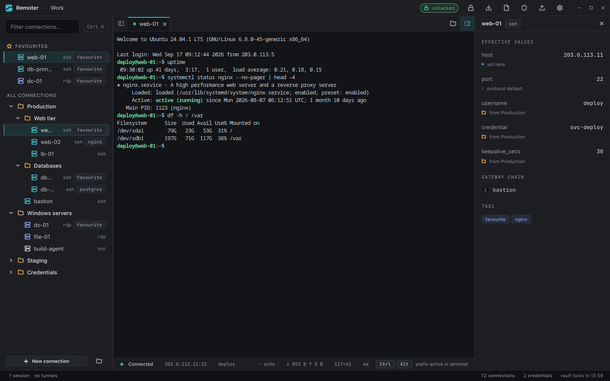
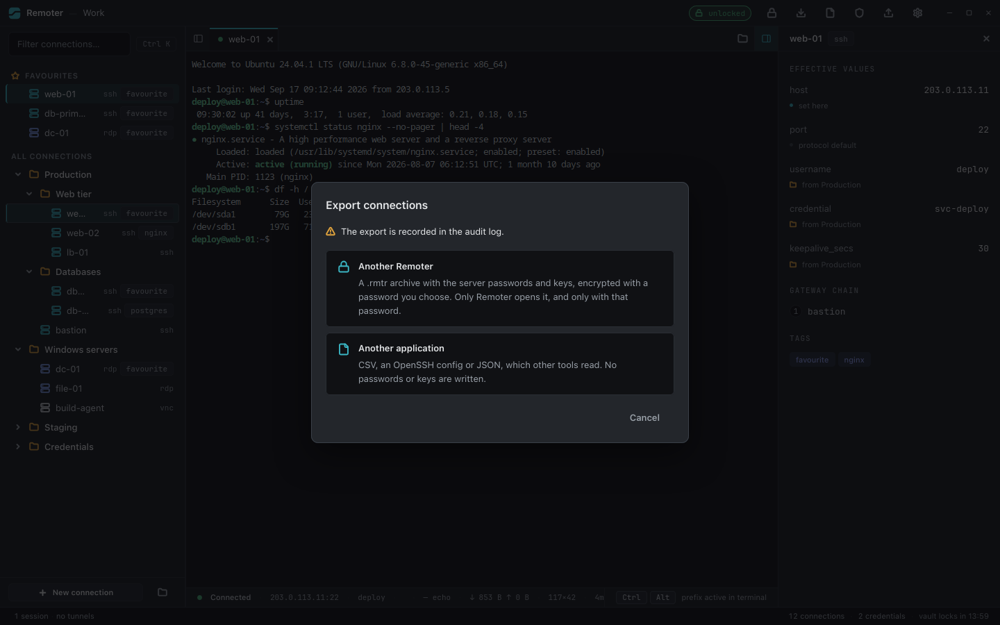
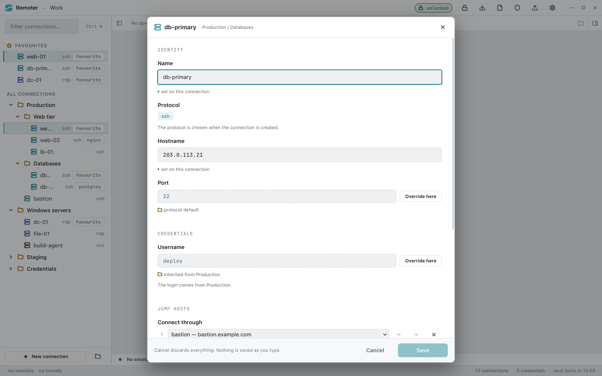
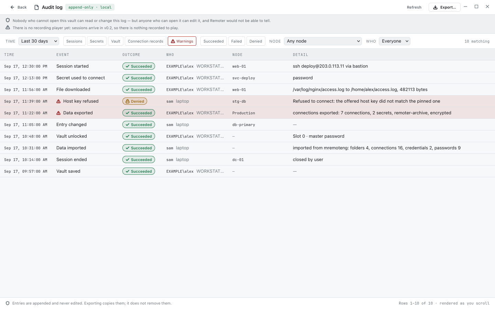

<div align="center">

# Remoter

**A modern, cross-platform remote connection manager.**

RDP · SSH · VNC · SFTP — every session in a tab, every secret in a vault you control.

[](LICENSE)
[](docs/roadmap.md)
[](#platform-support)

</div>

---

> **Project status: alpha, and it runs.** The vault, the connection tree and all
> four protocol adapters — SSH, SFTP, RDP and VNC — are implemented and have
> been used against real servers. Several advertised-looking features are not
> built yet: no session recording, no FIDO2 key slot, no FTP, no plugin host, no
> clipboard. [What works, and what does not](#what-works-today) is
> the honest table; the [roadmap](docs/roadmap.md) is where the rest sits.
>
> Do not put your only copy of a credential in it yet. Builds are unsigned and
> the vault format has not had its independent cryptographic review, which is a
> v1.0 release gate.

## What is Remoter?

Remoter is a connection manager for people who administer more than one machine.
It keeps an organised, searchable tree of servers, network devices and cloud
instances, stores their credentials in an encrypted vault, and opens every
protocol — RDP, SSH, VNC, SFTP — inside a single tabbed window.

It is a spiritual successor to tools like mRemoteNG and Royal TS, rebuilt around
three commitments:

1. **Real cross-platform parity.** Linux, Windows and macOS are first-class
   targets, not ports. The same vault file opens everywhere. *All three are
   tested in CI; Linux is the only one with day-to-day use behind it.*
2. **Cryptography you can audit.** Secrets are protected by an envelope scheme
   with independent key slots. The design is written down in
   [docs/security/](docs/security/), and the code that implements it is in
   [`crates/remoter-vault`](crates/remoter-vault).
3. **Extensibility by design.** Protocols, importers and credential backends sit
   behind stable interfaces. *The plugin ABI crates exist; the WebAssembly host
   that would load a plugin does not.*

## Screenshots

<p align="center">
  
</p>

<table>
  <tr>
    <td width="50%"></td>
    <td width="50%"></td>
  </tr>
  <tr>
    <td align="center">Export for another Remoter, secrets encrypted — or for other tools, without them</td>
    <td align="center">The connection editor: every inherited value says where it comes from</td>
  </tr>
  <tr>
    <td colspan="2"></td>
  </tr>
  <tr>
    <td colspan="2" align="center">The audit log names the account and computer behind every entry</td>
  </tr>
</table>

The pictures are taken from the real interface running on invented data — every
address is from the ranges reserved for documentation — by
[`scripts/readme-screenshots.cjs`](scripts/readme-screenshots.cjs).

## What works today

The left column is what a user can do in a running build. The right column is
what the [docs](docs/) still describe as the destination.

| Area | Works now | Not built yet |
|---|---|---|
| **Vault** | XChaCha20-Poly1305 body, Argon2id KDF, atomic saves, rolling backups, migrations | — |
| **Key slots** | Master password, password + key file, recovery key, OS keychain | **FIDO2 / hardware key** — the slot kind is reserved in the format and every code path refuses it |
| **Locking** | Manual lock, idle auto-lock, lock on resume from suspend (Linux) | Lock on screen lock or minimise — neither event is observable from this build, and the settings screen says so |
| **Tree** | Folders, connections, credential nodes, drag-and-drop, inheritance with per-field provenance and override, search with `tag:` `proto:` `host:` `user:` filters, a favourites section projected from the `favourite` tag, command palette | Multi-select and bulk edit, cut/copy/paste, undo, quick-connect address bar, "test connection", recently-used ordering, the inheritance diff shown before a move |
| **SSH** | A terminal that copies, pastes and clicks the way the platform's own does — Windows Terminal, Terminal.app, GNOME Terminal — including the Linux PRIMARY selection ([ADR-0015](docs/architecture/decisions/0015-terminal-follows-the-platform.md)); PTY shell and `exec`, public key / password / keyboard-interactive, host key TOFU and pinning, agent auth and agent forwarding (both off by default), environment variables, initial command, compression, keep-alive | GSSAPI/Kerberos, SSH certificates, X11 forwarding, per-connection algorithm preferences |
| **SFTP** | Dual-pane file manager on the session's own channel, transfer queue with live progress, resume, per-transfer cancel, rename, mkdir, delete, chmod, symlinks | Edit-in-place, pause, server-to-server, sync/mirror modes |
| **RDP** | TLS, NLA via CredSSP/NTLMv2, framebuffer, keyboard and pointer, keyboard layout taken from the local machine, server certificate pinning | Clipboard, audio, printing, drive redirection, multi-monitor, Kerberos, RD Gateway |
| **VNC** | RFB with Raw and CopyRect, `None` and VNC Authentication, view-only mode, an exposure warning on clear-text sessions | VeNCrypt/TLS, Tight/ZRLE/Hextile/RRE encodings, client-initiated resize, the clipboard |
| **Clipboard** | Nothing, on any protocol. Both framebuffer adapters report `clipboard: none`, there is no `session_clipboard` command, and the interface draws no control | Text both ways for RDP and VNC. VNC can already write the remote clipboard on the wire; what is missing is an event that carries text back and an IPC command to reach either direction |
| **Tunnels** | Local (`-L`), remote (`-R`) and dynamic SOCKS5 (`-D`) forwards, opened against a node with or without a shell, loopback by default with an explicit opt-in to expose | Persistent tunnels with auto-start and reconnect, SOCKS5 `UDP ASSOCIATE`, using a SOCKS or HTTP `CONNECT` proxy as a connection's transport |
| **Jump hosts** | Multi-hop chains through SSH connections, set in the connection editor on a connection or on a folder for everything in it, inherited like any other field and overridable with a chain of its own or with none; honoured by every protocol and by tunnels; imported from `ssh_config`'s `ProxyJump` | Choosing a per-hop credential in the editor — a hop logs in with its own connection's credential, and an imported per-hop credential is kept but cannot be changed here |
| **Import** | Remoter's own `.rmtr` archive with its passwords and keys, and its JSON export; mRemoteNG `confCons.xml` (GCM and legacy CBC); Remote Desktop Connection Manager `.rdg` and `.rdp` files (saved passwords stay with Windows, and each credential asks for its password); PuTTY and KiTTY sessions, straight from this computer's registry or `~/.putty/sessions` or from a `reg export`, with *SSH to proxy* turned into a gateway; `~/.ssh/config`, CSV — each with detection, preview, findings report, a choice about items the vault already has (keep both, skip or replace; existing folders are merged into) and an all-or-nothing commit | Royal TS; `known_hosts` into the trust store; a conflict choice per item; connecting with a credential that only references a key file on disk |
| **Export** | The whole vault or one folder, for **another Remoter** as an encrypted `.rmtr` archive with the server passwords and keys — sealed under a password you set, bringing along the shared credentials and jump hosts the folder uses — or for **other tools** as CSV (one row per connection, inherited values written in), an OpenSSH config (SSH and SFTP connections as `Host` blocks, routes as `ProxyJump`) or JSON (the tree as stored). The flat formats never carry a secret and say what they could not carry; all four read back through their importers; recorded in the audit log | Plaintext secret export |
| **Audit log** | Append-only inside the vault: vault lifecycle, key slots, node changes, imports and exports, secret use, trust decisions, sessions, files uploaded and downloaded, settings. Each entry names the account and computer that wrote it, per operating system, with a Who column and filter. Filterable viewer, JSON and CSV export | Remote file delete and rename events, plugin events; retention policy; the external audit sink |
| **Recording** | — | **Everything.** There is no recorder, no player and no `remoter-record` crate. Sessions report a `recordable` capability that nothing consumes |
| **Interface** | React 19 + CSS modules, four themes (light, dark and a high-contrast pair) following the OS by default, editable terminal palette with a live contrast check, full keyboard navigation, ten languages including RTL | Tab detach, split view, session groups and layouts, broadcast typing, the WCAG 2.2 AA audit across all four themes |
| **Protocols** | SSH, SFTP, RDP, VNC | FTP/FTPS, Telnet, serial, local shell, and everything behind the plugin host |

## Platform support

| | Linux | Windows | macOS |
|---|---|---|---|
| Minimum | glibc 2.35+ (WebKitGTK 2.38+) | Windows 10 1809+ | macOS 12+ |
| Tested in CI | ✅ | ✅ | ✅ |
| Run by a person | Daily | Yes — the drag-and-drop and linker fixes came from it | Not that anyone has reported |
| Packages | AppImage, `.deb`, `.rpm` | `.msi`, NSIS | `.dmg` (universal) |

Builds are **unsigned**, so Windows SmartScreen and macOS Gatekeeper will warn
about them; checksums are the only integrity story a release has today. See
[build-release.md](docs/development/build-release.md).

## Installing

Take the file for your platform from
[Releases](https://github.com/bbesli/Remoter/releases) — no Rust toolchain, no
build. The notes on each release say which file is which, list the SHA-256 of
every one, and walk through the security warning your operating system will show
for an unsigned application: *More info → Run anyway* on Windows, and
*System Settings → Privacy & Security → Open Anyway* on macOS 15 or newer
(Control-click → Open on macOS 12 to 14).

On Windows 10 the installer fetches the Edge WebView2 runtime if it is missing,
so the machine needs to be online while it installs. Windows 11 already has it.

To build from source instead, carry on below.

## Architecture at a glance

```
┌──────────────────────────────────────────────────────────┐
│  Web frontend  (React · TypeScript · CSS modules · xterm)│
│  connection tree · tabs · terminal · framebuffer canvas   │
└───────────────────────────┬──────────────────────────────┘
                            │  Tauri IPC (typed commands, raw byte payloads)
┌───────────────────────────┴──────────────────────────────┐
│  Rust core                                                │
│                                                           │
│  remoter-vault    envelope crypto, key slots, storage     │
│  remoter-core     connection tree, inheritance resolution │
│  remoter-proto    Protocol trait, supervisor, hop chains  │
│    ├─ ssh (russh) — shell, SFTP, forwarding, SOCKS5       │
│    ├─ rdp (IronRDP)                                       │
│    └─ vnc (vnc-rs)                                        │
│  remoter-import   confCons.xml · ssh_config · CSV, export │
│  remoter-ipc      the Tauri command surface               │
│  remoter-plugin-abi / -sdk   plugin ABI, no host yet      │
└───────────────────────────────────────────────────────────┘
```

SFTP, port forwarding and the SOCKS5 server live inside `remoter-proto-ssh`
rather than in crates of their own: they are channels on an SSH connection, and
splitting them out would have meant one crate re-exporting another's session
handle. Read the full design in
[docs/architecture/overview.md](docs/architecture/overview.md).

## Why Tauri and Rust?

Because a tool that holds every credential you own should be small, memory-safe
and inspectable. The Rust core gives us memory-safe protocol parsers and a
first-class cryptography ecosystem; Tauri gives us a native binary instead of a
bundled browser. The reasoning, including what we gave up, is recorded in
[ADR-0001](docs/architecture/decisions/0001-technology-stack.md).

## Documentation

The documents in [`docs/`](docs/) are **specifications**: they describe the
product being built, and most of them describe more than is built. Every file in
[`docs/features/`](docs/features/) and [`docs/architecture/`](docs/architecture/)
opens with a note saying which part of it ships — thirteen files; `decisions/`
is excluded, because an ADR records a decision rather than a status — and
individual claims are marked ✅ / ◐ / ⏳ in place. Six documents elsewhere under
`docs/` open with a note too. Both of those counts, every relative link and
every `#fragment` in this repository's Markdown are checked by
[`scripts/check-docs.sh`](scripts/check-docs.sh), so neither number is something
a reader has to take on trust. Where a document and the code disagree about what
exists, the code is what you get.

| Document | What it covers |
|---|---|
| [Architecture overview](docs/architecture/overview.md) | System design, crate layout, data flow |
| [Architecture decisions](docs/architecture/decisions/) | ADRs — every significant choice and its trade-offs |
| [Threat model](docs/security/threat-model.md) | What we defend against, and what we do not |
| [Vault format](docs/security/vault-format.md) | On-disk format, key slots, recovery key |
| [Data model](docs/architecture/data-model.md) | Connections, folders, credentials, inheritance |
| [Session pipeline](docs/architecture/session-pipeline.md) | How a click becomes a live remote session |
| [Protocols](docs/features/protocols.md) | Per-protocol capability matrix, shipped and planned |
| [Plugin system](docs/architecture/plugin-system.md) | WebAssembly ABI, capabilities, sandbox |
| [Roadmap](docs/roadmap.md) | What shipped, and what lands when |
| [Getting started](docs/development/getting-started.md) | Toolchain setup and first build |
| [Glossary](docs/glossary.md) | Terms used throughout the docs |

## Building from source

You need **Rust 1.89+**, **Node 22+**, and your platform's WebView development
packages — [docs/development/getting-started.md](docs/development/getting-started.md)
lists them per distribution.

> The workspace's `Cargo.toml` still declares `rust-version = "1.85"`. That is
> knowingly stale and documented there: `ironrdp` 0.17 requires 1.89 and
> `keyring` 4.2 requires 1.88, so nothing has actually built on 1.85 since the
> RDP adapter landed.

```bash
git clone https://github.com/bbesli/Remoter.git
cd Remoter
npm install --prefix apps/desktop/ui
```

The Tauri CLI looks for `tauri.conf.json` in the directories **below** the one
it is run from, and this workspace keeps it in `apps/desktop/src-tauri`. So it
has to be run from `apps/desktop`, while the CLI itself is installed under
`apps/desktop/ui/node_modules` — which is why the two paths differ:

```bash
cd apps/desktop && ./ui/node_modules/.bin/tauri dev
```

```bash
cd apps/desktop && ./ui/node_modules/.bin/tauri build --no-bundle
```

`--no-bundle` stops at the executable instead of building an installer. The
binary is `target/release/remoter-desktop`, at the top of the workspace — not
under `apps/desktop`, because the whole Cargo workspace shares one target
directory. Drop `--no-bundle` and the installers land in
`target/release/bundle/`.

On Windows, in PowerShell, the same two commands with the platform's path
separator and the `.cmd` shim npm installs:

```powershell
cd apps\desktop; .\ui\node_modules\.bin\tauri.cmd build --no-bundle
```

Windows also needs the Visual Studio Build Tools with the "Desktop development
with C++" workload — Rust uses its linker — and WebView2, which ships with
Windows 11 and is a separate download on Windows 10.

On Linux, `scripts/install-local.sh` does the release build and installs it for
the current user, replacing any running instance:

```bash
scripts/install-local.sh
```

### Checks

```bash
cargo clippy --workspace --all-targets -- -D warnings
cargo test --workspace
npm run typecheck --prefix apps/desktop/ui
npm run lint --prefix apps/desktop/ui
npm test --prefix apps/desktop/ui
scripts/check-docs.sh
```

Live protocol tests are behind the `integration-tests` feature and need a real
server. `scripts/dev-sshd.sh` starts a throwaway OpenSSH instance for the SSH
and SFTP ones; there is no fixture yet for RDP or VNC.

## Contributing

Contributions are welcome — especially protocol work, cryptography review,
translations and platform packaging. Start with
[CONTRIBUTING.md](CONTRIBUTING.md) and the
[good first issue](https://github.com/bbesli/Remoter/labels/good%20first%20issue)
label.

If you believe you have found a security vulnerability, please **do not** open a
public issue. Follow [SECURITY.md](SECURITY.md) instead.

## Licence

Remoter is free software, licensed under the
[GNU General Public License v3.0 or later](LICENSE). You may use, study, share
and modify it; if you distribute a modified version, it must remain free
software under the same licence.

**Plugins are exempt.** WebAssembly plugins that interact with Remoter solely
through the published plugin ABI may carry any licence, including a proprietary
one. This rests on two things: the crates a plugin author compiles against
(`remoter-plugin-abi`, `remoter-plugin-sdk`) are Apache-2.0 OR MIT, and the host
grants an explicit additional permission under GPL-3.0 §7, published as
[LICENSE-EXCEPTION](LICENSE-EXCEPTION). The exception does not extend to forks
of Remoter itself, which remain GPL in full. The reasoning is in
[ADR-0009](docs/architecture/decisions/0009-plugin-licence-exception.md).
